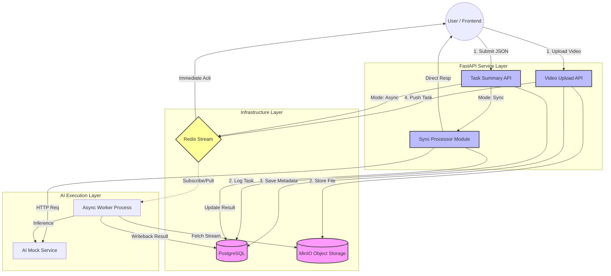

# Backend

### System Workflow
The system employs a Producer-Consumer pattern to decouple heavy AI inference from the API response cycle.


### Project Structure
```bash
backend/
├── api/              # API Routes and Business Logic
├── core/             # Database Models (SQLAlchemy)
├── mock_services/    # Independent AI Mock Provider
├── tests/            # Pytest Suite (Unit & Integration)
├── processor.py      # Synchronous AI Task Handler
├── database.py       # Database Engine & Session Config
├── worker_run.py     # Redis Stream Consumer (Worker)
├── main.py           # Application Entry Point
└── pytest.ini        # Testing Configuration
```
### Prerequisites
#### Hardware & OS
OS: Windows 11 / Linux

Python: 3.12.x

#### Infrastructure
Redis: Task queuing (v5.0+)

PostgreSQL: Metadata storage (v16+)

MinIO: Large file object storage

### Environment Setup
#### Conda Environment (Miniforge)
install conda (miniforge) and setup env
```bash
conda create -n edu-ai python=3.12
conda activate edu-ai
```
#### .condarc
```bash
channels:
  - https://mirrors.tuna.tsinghua.edu.cn/anaconda/cloud/conda-forge/
  - https://mirrors.ustc.edu.cn/anaconda/cloud/conda-forge/
  - conda-forge
mirrored_channels:
  conda-forge:
    - https://conda.anaconda.org/conda-forge
    - https://prefix.dev/conda-forge
ssl_verify: false
proxy_servers:
  http: http://proxy-dmz.intel.com:911
  https: http://proxy-dmz.intel.com:912
```
```
conda install -c conda-forge psycopg2 redis-py
pip install fastapi uvicorn httpx pydantic-settings
```
python (3.12.x) C:\Users\user\miniforge3\python.exe

```powershell
conda activate edu-ai
pip install -r requirements.txt
```
#### backup env
conda env export > environment.yml
#### restore env
conda env create -f environment.yml

### Running the System
#### Prepare 3rdpart modules
copy `education-ai-suite/content-search/content_search_minio` under `backend/ext_components/storage_minio` or just create a softlink,
like
```bash
tree -L 3 ext_components/
ext_components/
├── readme.md
└── storage_minio
    └── content_search_minio -> /xx/x/edge-ai-suites/education-ai-suite/content-search/content_search_minio
```
#### Launch the serives
```powershell
# Terminal A
& "C:\Users\user\miniforge3\envs\edu-ai\python.exe" .\main.py

# Terminal B
& "C:\Users\user\miniforge3\envs\edu-ai\python.exe" .\worker_run.py

# Terminal C
& "C:\Users\user\miniforge3\envs\edu-ai\python.exe" .\mock_services\dummy_ai_provider.py
```

### API Usage & Testing
#### Synchronous Summary (Immediate Result)
Method: POST

Endpoint: http://127.0.0.1:8000/api/tasks/video-summary

Body (JSON):
```json
{
    "video_url": "C:/videos/classroom_test.mp4",
    "sync": true
}
```

#### Asynchronous Summary (Webhook Notification)
Method: POST

Endpoint: http://127.0.0.1:8000/api/tasks/video-summary

Body (JSON):
```json
{
    "video_url": "C:/videos/test.mp4",
    "sync": false,
    "callback_url": "[https://webhook.site/your-unique-id](https://webhook.site/your-unique-id)"
}
```
webhook.site
https://webhook.site/ unique URL: e.g. https://webhook.site/28865adb-376c-4a0a-ac59-5204a60f9fe3

#### Video Upload (MinIO Integration)
Method: POST

Endpoint: http://127.0.0.1:8000/api/tasks/video-upload

Body: form-data | key: video_file | type: File

### Automated Tests
```powershell
pip install -r .\tests\requirements.txt
pytest .\tests\pytest -v
```

### Debug tools
pgadmin 4
tiny RDM


### Others
install Redis
https://github.com/tporadowski/redis/releases

install PostgreSQL
16.11.3 https://www.postgresql.org/download/windows/ passwd: edu-ai port: 5432

install postman
xxx
