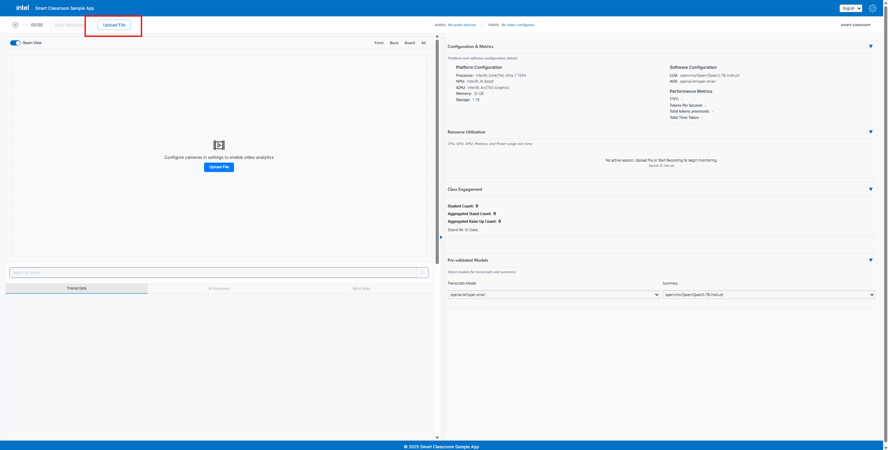
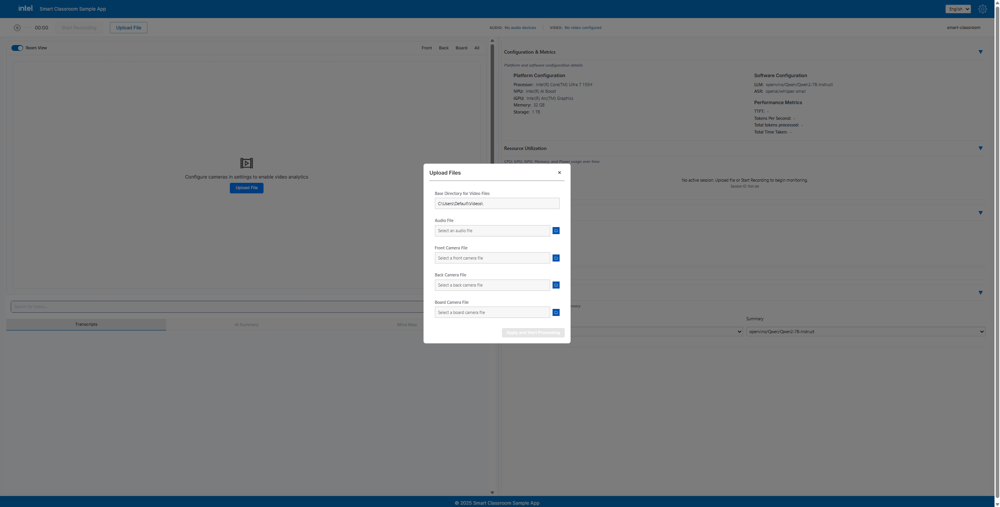
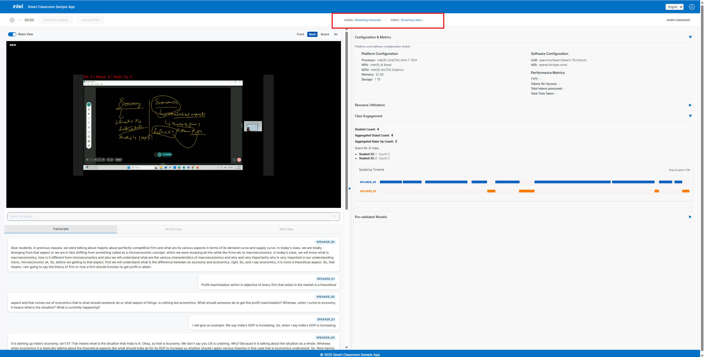
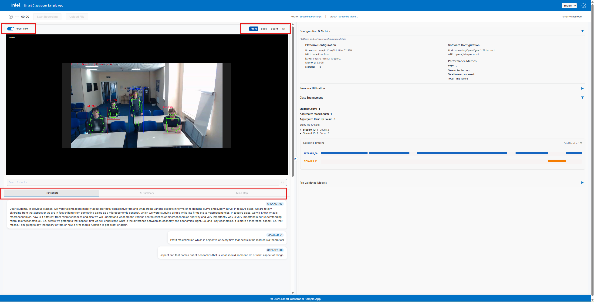

# Application Flow

This documentation provides the end-to-end flow of the application, helps you initiate the setup, and guides you in observing and validating the results.

*Application can be initiated either by using **Upload Files** or by clicking **Start Recording**.This documentation will guide you with upload files.*

## 1) Upload Files

By clicking any one of the upload file buttons, will open a modal for audio and video files inputs

**Base Directory Path should be folder path of video files (user should manually add/copy the path)**

Audio → *.mp3 or .wav* \
Video → *.mp4*

  
  

**After successful upload click Apply&Start Processing**

## 2) Audio Analysis and Video Streaming

Application will start transcription after analyzing the audio and videos will get stream parallelly as below.

*Right Panel shows the monitoring of CPU, GPU, NPU, Memory and Power Utilization*

## 3) Tabs Switch

User can switch between tabs as shown below

The Room View toggle allows the user to switch between full audio–video mode and audio-only mode. When disabled, the video component is hidden and only the audio panel remains visible.

## 4) Final State

Audio → After transcription and post summary, MindMap gets generated \
Video → Class Statistics are displayed from video process

