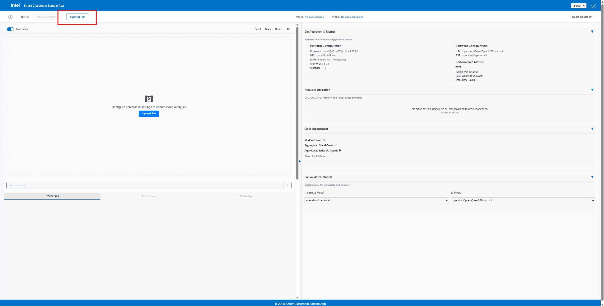
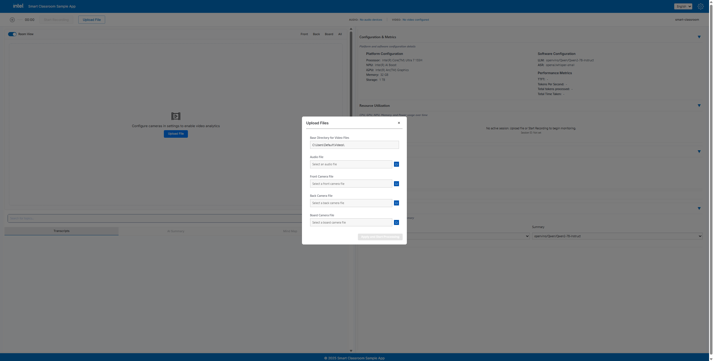
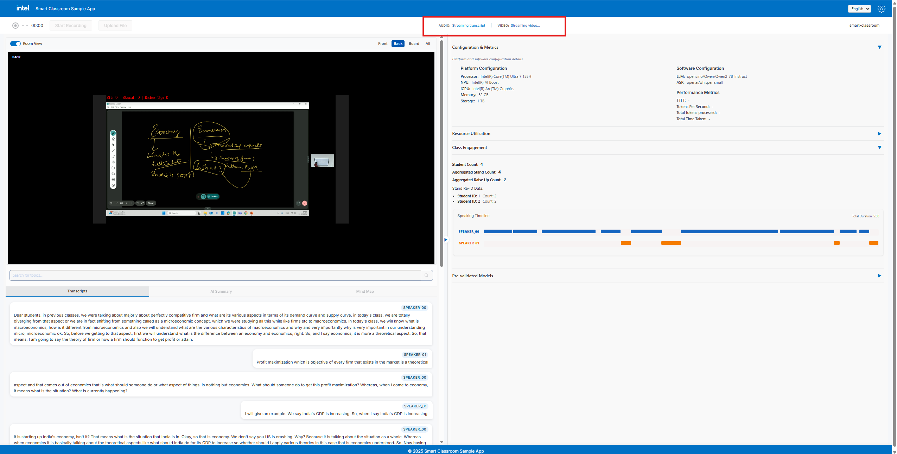
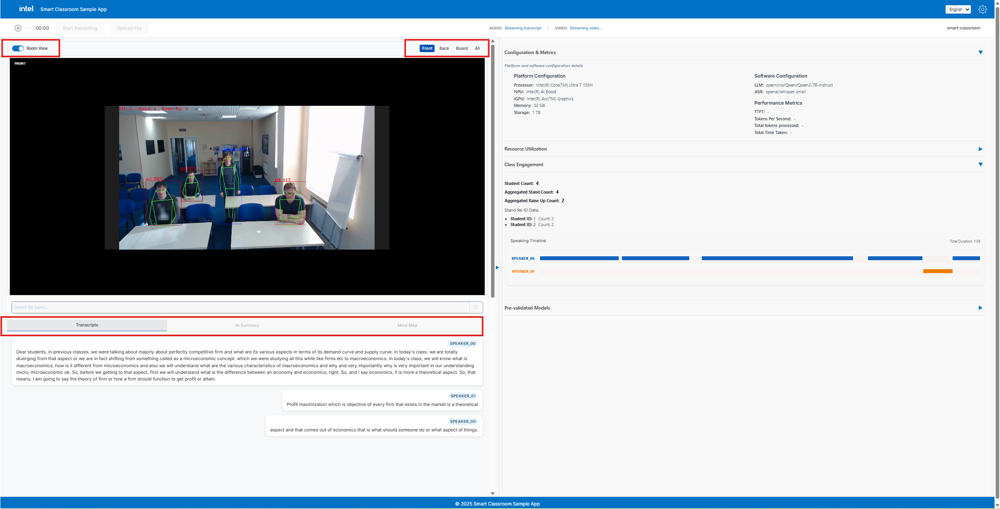
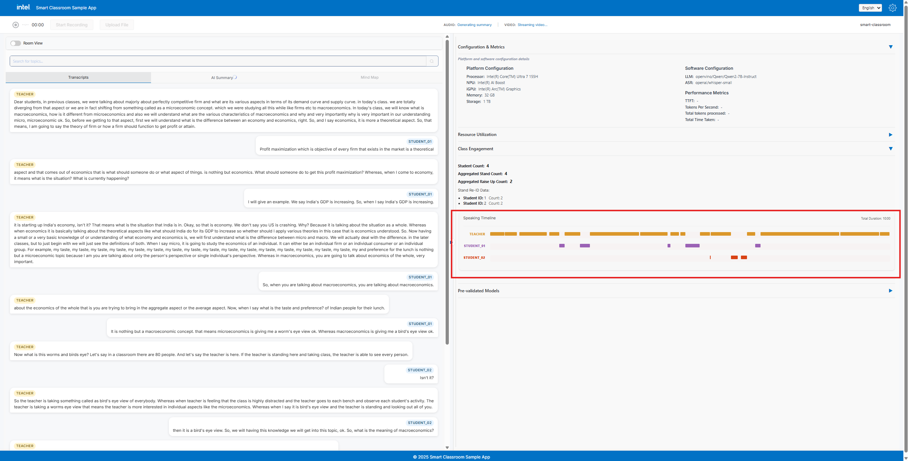
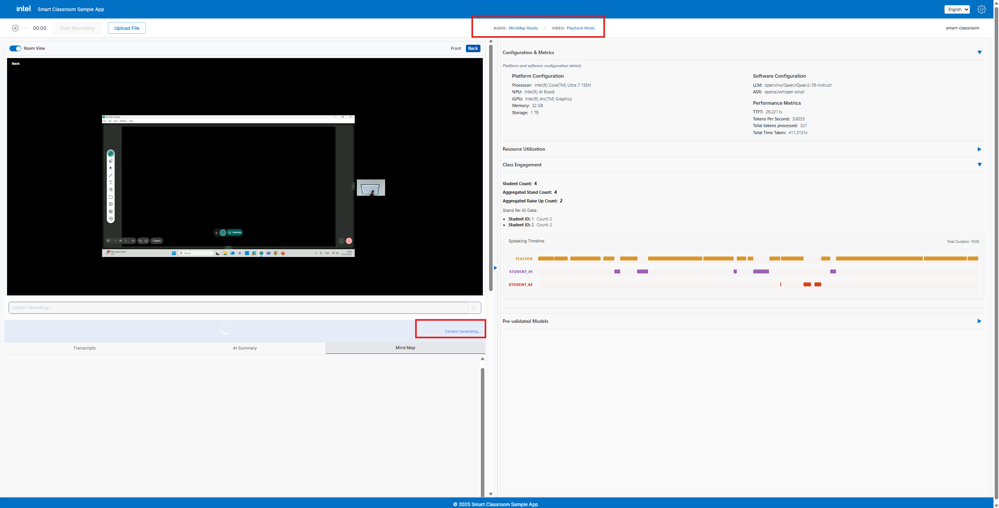
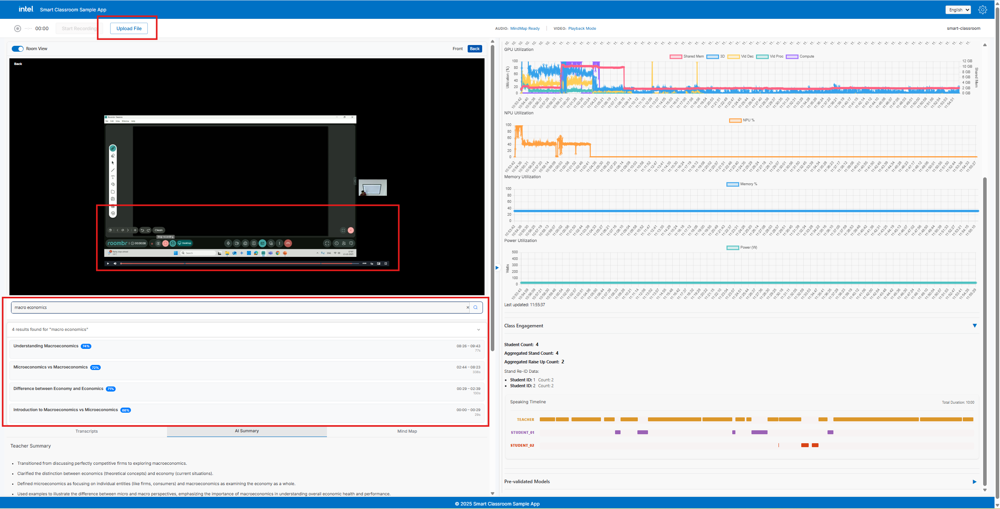

# Application Flow

This documentation provides the end-to-end flow of the application, helps you initiate the setup, and guides you in observing and validating the results.

*Application can be initiated either by using **Upload Files** or by clicking **Start Recording**.This documentation will guide you with upload files.*

## 1) Upload Files

By clicking any one of the upload file buttons, will open a modal for audio and video files inputs

**Base Directory Path should be folder path of video files (user should manually add/copy the path)**

Audio → *.mp3 or .wav or .m4a* \
Video → *.mp4*

  
  

**After successful upload click Apply&Start Processing** \
*Note: Search is enabled only after content segmentation*

## 2) Audio Analysis and Video Streaming

Application will start transcription after analyzing the audio and videos will get stream parallelly as below.

### Right Panel:
**Configuration Metrics** - Deatails about the platform and software configuration along with performance metrics of summarization\
**Resource Utilization** - Live monitoring of CPU, GPU, NPU, Memory and Power Utilization \
**Class Engagement** - Statistics of student engagement and speaker's timeline during the class (real-time) \
**Pre-Validated Models** - Shows the models being used for transcription and summarization

## 3) Tabs Switch

User can switch between tabs as shown below

The Room View toggle allows the user to switch between full audio–video mode and audio-only mode. When disabled, the video component is hidden and only the audio panel remains visible.

## 4) Transcription and Speaker Timeline

*Once Teacher is identified, labels are updated accordingly*

## 5) Content-Segmentation

*After mindmap is generated and video processing completed, Content segmentation starts and video playback is enabled for video search*

Audio+Video -> content segmentation is enabled after mindmap is generated and video processing completed 

## 6) Final State

Audio → After transcription and post summary, MindMap gets generated \
Video → After video Processing playbackMode is enabled and based on the topic-search the results are shown \
VideoSearch -> Based on search results the video timeline is highlighted on the respective time-stamps of topic

