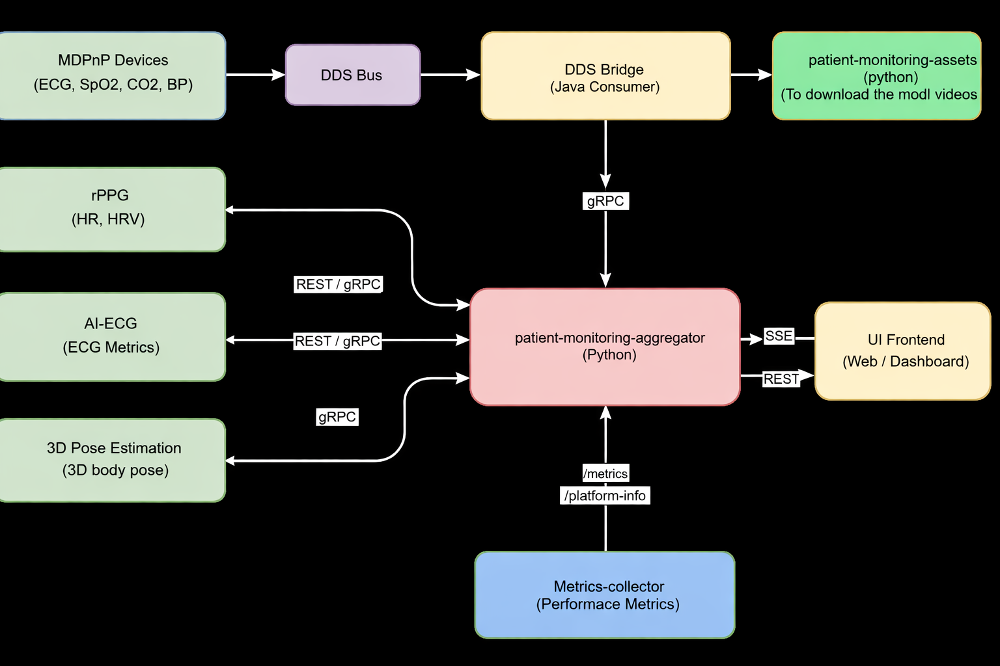

## System Design

This section describes the overall architecture of the multi‑modal patient monitoring application and explains the responsibilities of each service.

### High‑level Architecture

At a high level, the system is composed of several microservices that work together to ingest patient signals and video, run AI models on Intel hardware (CPU, GPU, and NPU), aggregate results, and expose them to a UI for clinicians.

The main services in this deployment are:

- Patient Monitoring Assets
- Patient Monitoring Aggregator
- RPPG (Remote Photoplethysmography)
- Metrics Collector
- UI

The following sections describe each service in more detail.

### Patient Monitoring Assets Service

The **patient-monitoring-assets** service is responsible for preparing all AI assets required by the workload:

- Downloads or generates AI models (for example, the MTTS‑CAN model used by the RPPG service) and converts them to OpenVINO IR format.
- Downloads reference video assets and places them in shared volumes (for example, the `videos` volume consumed by RPPG).
- Writes models into a shared `models` volume, making them available to downstream services without embedding them directly in each container.

This service typically runs to completion at startup and then exits once all artifacts are prepared.

### Patient Monitoring Aggregator Service

The **patient-monitoring-aggregator** service is the central gRPC endpoint for vital signs:

- Exposes gRPC APIs that accept waveform and numeric vitals from producer services such as RPPG.
- Maintains per‑patient (or per‑device) state, including time‑series histories of vitals.
- Computes or stores aggregated metrics that can be consumed by the UI or other downstream components.

In the default configuration, the aggregator listens on a gRPC port (for example, 50051) and is reachable by all AI producer services over the host network.

### RPPG Service

The **rppg** service performs remote photoplethysmography on patient video streams to estimate heart rate (HR) and respiratory rate (RR):

- **Video ingestion:** Reads frames from the shared `videos` volume (for example, `sample.mp4`) using `VideoHandler`, with optional looping and frame‑rate adaptation.
- **Preprocessing:** Crops a region of interest (ROI) on the face and resizes frames to the model input size using `Preprocessor`. Frames are accumulated into batches.
- **AI inference:** Runs the MTTS‑CAN OpenVINO model using the `InferenceEngine`, targeting Intel GPU or NPU (`RPPG_DEVICE`) with automatic fallback to CPU when needed.
- **Post‑processing:** Converts raw model output into pulse and respiration waveforms and derives numeric HR and RR estimates using `SignalPostprocessor`.
- **Streaming to aggregator:** Packages results into waveform and numeric vitals and streams them to the patient‑monitoring‑aggregator via the `RPPGGRPCClient`.

The RPPG service also exposes a small HTTP control API to start/stop streaming, allowing dynamic control during demos or testing.

### Metrics Collector Service

The **metrics-collector** service gathers hardware and system metrics from the host to provide observability of AI workloads:

- Runs in a privileged container with access to host devices (for example, `/dev/dri`, `/dev/accel/accel0`) and system paths under `/sys` and `/proc`.
- Collects GPU, NPU, CPU, memory, and power statistics from telemetry tools and kernel interfaces.
- Writes raw logs (for example, qmassa JSON and NPU CSV) into a shared metrics directory, and can expose summarized metrics via its own API.

These metrics are useful for validating that AI workloads are correctly utilizing Intel accelerators and for performance benchmarking.

### UI Service

The **ui** service provides a web‑based dashboard for clinicians or developers:

- Connects to the patient‑monitoring‑aggregator to retrieve current and historical vitals.
- Visualizes waveforms (e.g., pulse and respiration) and numeric vitals (e.g., HR, RR) in real time.
- May also integrate system‑level metrics from the metrics‑collector to show hardware utilization alongside clinical signals.

The UI is typically exposed on a configurable HTTP port (for example, 3000) and accessed via a standard web browser.

### Data and Control Flows

Putting the pieces together:

1. **Assets initialization** – patient-monitoring-assets populates the shared `models` and `videos` volumes.
2. **RPPG inference** – the rppg service reads video frames, preprocesses them, and runs the MTTS‑CAN model on Intel hardware (CPU/GPU/NPU) via OpenVINO.
3. **Vitals aggregation** – RPPG streams waveform and numeric vitals to patient-monitoring-aggregator over gRPC.
4. **Monitoring and observability** – metrics-collector continuously records hardware utilization and other system metrics.
5. **Visualization** – the UI queries the aggregator (and optionally metrics endpoints) to present vitals and system status to end‑users.

This modular architecture allows each component to be developed, deployed, and scaled independently while sharing common assets and infrastructure.

