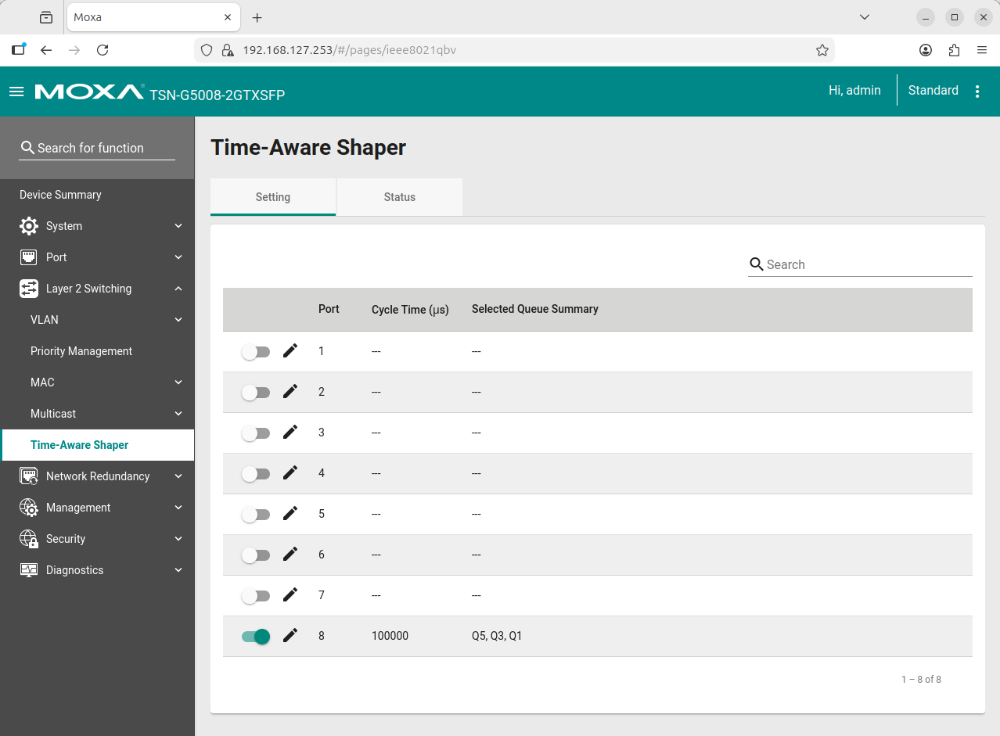

# How to Enable TSN Traffic Shaping (IEEE 802.1Qbv)

Time-Sensitive Networking (TSN) traffic shaping, specifically the Time-Aware Shaper defined in IEEE 802.1Qbv, is a critical feature for achieving determinism in industrial networks. It allows you to create protected time slots on the network, ensuring that high-priority, time-critical data is not delayed by lower-priority traffic.

This guide provides a general overview of how to configure the Time-Aware Shaper on the MOXA TSN-G5000 series switch.

## Key Concepts

*   **Gate Control List (GCL)**: This is the core of the Time-Aware Shaper. The GCL is a schedule that defines which traffic queues are open or closed at specific points in time for a given port.
*   **Time-Triggered Gates**: By opening and closing gates for different traffic classes according to a repeating cycle, you can guarantee that high-priority frames (like those from a camera or critical sensor) have exclusive access to the network medium.
*   **Cycle Time**: The GCL operates on a repeating cycle, synchronized across all TSN-enabled devices on the network via gPTP (IEEE 802.1AS).

## Configuration Steps (General Guide)

Following are steps to configure the Time-Aware Shaper on a MOXA TSN switch. The exact steps may vary based on the switch model and firmware version, so refer to the official documentation for detailed instructions.

1. **Access the Switch Web Interface**: Log in to the MOXA TSN switch web interface using the default IP address, username, and password.
2. **Navigate to TSN Configuration**: Layer 2 Switching > Time-Aware Shaper > Click edit for the port to which you want to configure

3. **Enable Time-Aware Shaper**: Click add icon to add multiple Gate Control Lists (GCLs) as needed.

Currently, we have three critical streams that need to be protected from interference by best-effort traffic. Each stream is operating at a rate of 30 frames per second (fps), meaning a new frame is generated approximately every 33ms. To accommodate all three streams, we will create a Gate Control List (GCL) with a cycle time of 100ms. Since the sensor data doesn't require the full 33ms for each frame, we estimate that approximately 90ms will be needed to handle all the critical traffic, leaving 10ms available for best-effort traffic.

> **Important Note**
> The configuration of the Gate Control List is highly specific to the application's requirements, including the number of streams, data packet sizes, and desired latency. The values used above are for illustrative purposes only. For precise instructions and advanced settings, please consult the official [Moxa TSN-G5000 Series User Manual](https://www.moxa.com/getmedia/a0db0ef9-2741-4bad-91c6-1ec1827aca64/moxa-tsn-g5000-series-web-console-manual-v2.3.pdf).
