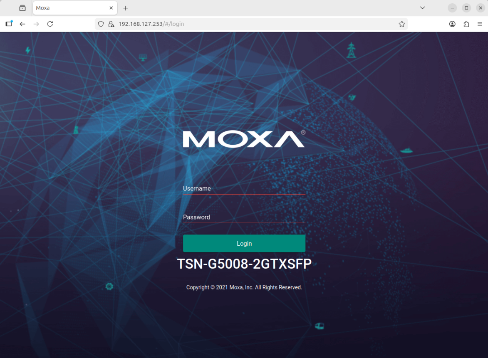

# Configure the MOXA TSN Switch

## Overview

The `MOXA TSN-G5000 Series` is a family of industrial Ethernet switches designed for Time-Sensitive Networking (TSN) applications. These switches combine traditional managed switch capabilities with advanced TSN features defined in IEEE 802.1 standards, making them ideal for real-time automation, industrial vision systems, and edge AI workloads where deterministic delivery of critical data is essential.

In this sample application, the TSN-G5000 switch serves as the central network fabric connecting multiple RTSP cameras, edge processing nodes, sensor producers, and a traffic generator. It enables both traffic isolation and scheduled forwarding to guarantee consistent performance under mixed traffic conditions.

## Accessing the Web Interface

To configure the switch, you will need to access its web-based management interface.

> **Note:**
> On reset, the MOXA TSN switch will have the default IP address `192.168.127.253`. Make sure your computer is in the same subnet to access the web interface. The default username is `admin` and the default password is `moxa`.

## Further Reading

For more detailed information, refer to the official user manual:

- [Moxa Managed Switch TSN-G5000 Series User Manual](https://www.moxa.com/getmedia/a0db0ef9-2741-4bad-91c6-1ec1827aca64/moxa-tsn-g5000-series-web-console-manual-v2.3.pdf)
