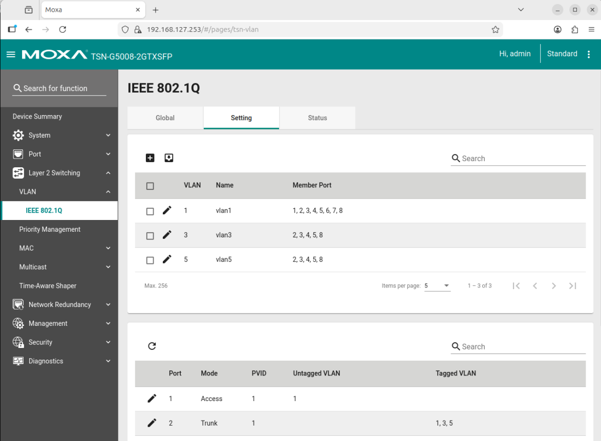

# Configure VLAN on MOXA Switch

## Prerequisites

Ensure the MOXA switch is set to its default configuration, as per the [MOXA TSN Switch configuration guide](./configure-moxa-switch.md),
before proceeding with VLAN configuration.

## MOXA Switch VLAN Configuration

Identify the switch port for each connected machine. You will then configure each port to
handle tagged VLAN traffic for the specific VLAN IDs the connected machine requires.

> **For example:** if machine 1 is connected to port 2 of the MOXA switch, and machine 1 can handle
>the traffic on the VLAN ID 1, 3, and 5, then set the port 2 as tagged VLAN for VLAN ID 1, 3,
> and 5.

1. Access the MOXA switch web interface by entering the switch's IP address(`192.168.127.253`)
in a web browser.
2. Log in with your credentials.
3. Navigate to the "`VLAN` > `IEEE 802.1Q`" section in the menu.
4. Create VLANs with IDs 1, 3, and 5 if they do not already exist.

5. Assign the appropriate ports to the VLANs as tagged ports by clicking edit (🖉) on the
specific port.

6. Apply the configuration and reboot the switch if necessary.
7. Verify the VLAN configuration by checking the port settings and ensuring that the correct
VLANs are assigned.

Refer to the MOXA switch user manual for detailed instructions specific to your switch model.
