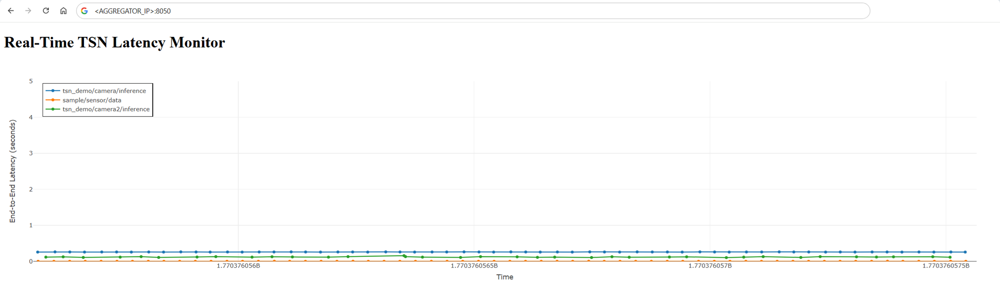

# Run the MQTT Aggregator and Visualization

This guide explains how to run the `mqtt_data_aggregator.py` script. This script subscribes
to multiple MQTT topics, calculates the end-to-end latency of the messages, and visualizes
the results in a real-time web-based dashboard.

## Overview

The `mqtt_data_aggregator.py` script is a powerful tool for monitoring the performance of your
TSN setup. It is a Dash application that:

-   Connects to multiple MQTT brokers simultaneously.
-   Subscribes to specified topics to receive data from cameras and sensors.
-   Calculates the latency by comparing the message reception time with the PTP timestamp in
the payload.
-   Plots the latency for each topic on a live graph.
-   Provides a web interface to view the visualization.

## Prerequisites

Before running the script, ensure you have Python 3 and the required libraries installed.

```bash
pip install dash paho-mqtt plotly
```

## Running the Script

Navigate to the `deterministic-threat-detection/mqtt_data_aggregator` directory and run the
script. You will need to provide the correct broker IP addresses for each topic.

```bash
cd deterministic-threat-detection/mqtt_data_aggregator
python3 mqtt_data_aggregator.py --topic-brokers "tsn_demo/camera1/inference:<CAMERA1_BROKER_IP>" "tsn_demo/camera2/inference:<CAMERA2_BROKER_IP>" "sample/sensor/data:<SENSOR_BROKER_IP>"
```

Replace `<CAMERA1_BROKER_IP>`, `<CAMERA2_BROKER_IP>`, and `<SENSOR_BROKER_IP>` with the IP
addresses of the machines running the respective MQTT brokers (or the machines generating the
data).

## Viewing the Dashboard

Once the script is running, open a web browser and navigate to the following address:

`http://<AGGREGATOR_IP>:8050`



Replace `<AGGREGATOR_IP>` with the IP address of the machine where you are running the
`mqtt_data_aggregator.py` script. You will see a real-time plot of the end-to-end latency for
each data stream.

## Command-Line Arguments

The script can be customized with the following command-line arguments:

| Argument | Description | Default Value |
|----------|-------------|---------------|
| `--topic-brokers` | A list of topic and broker IP address pairs in the format `'topic:broker_ip'`. | `tsn_demo/camera1/inference:localhost`, `tsn_demo/camera2/inference:localhost`, `sample/sensor/data:localhost` |
| `--port` | The port number for the MQTT brokers. | `1883` |
| `--window-seconds`| The time window in seconds to display on the plot. | `2` |
| `--y-min` | The minimum value for the Y-axis. | `0` |
| `--y-max` | The default maximum value for the Y-axis. The plot will auto-scale if latency exceeds this. | `5` |
| `--dash-port` | The port for the Dash web interface. | `8050` |

### Example

To run the aggregator with a 5-second plot window and a default Y-axis max of 10 seconds, you
would use:

```bash
python3 mqtt_data_aggregator.py --topic-brokers "tsn_demo/camera1/inference:192.168.1.101" "tsn_demo/camera2/inference:192.168.1.102" "sample/sensor/data:192.168.1.103" --window-seconds 5 --y-max 10
```
