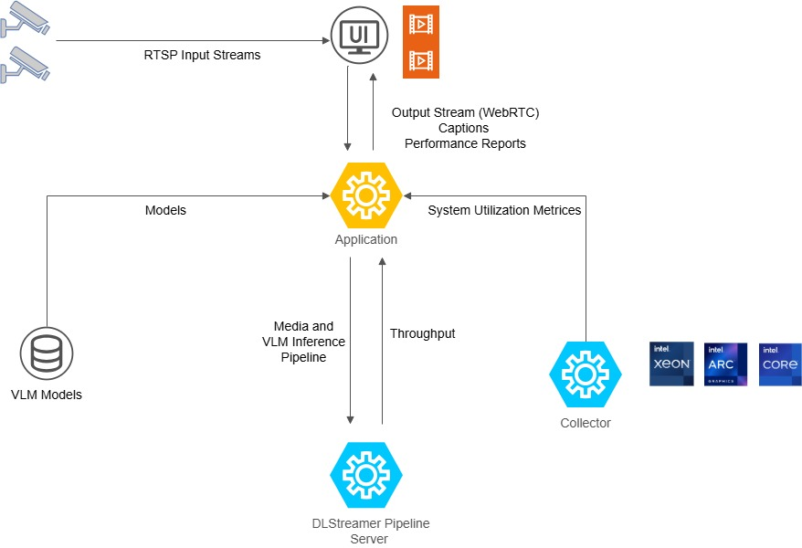

# Live Video Captioning

Deploy AI-powered captioning for live video streams with Intel DLStreamer and OpenVINO Vision Language Models. Process RTSP streams, generate real-time captions, and monitor performance metrics on a dashboard.

## Table of Contents

1. [Overview and Features](#overview-and-features)
2. [How the Application Works ](#how-the-application-works)
3. [Learn More](#learn-more)

## Overview and Features

### Use Cases

**Real-time Video Analytics**: Monitor security cameras, industrial equipment, or public spaces with AI-powered scene understanding and automatic captioning.

**Accessibility Enhancement**: Generate live captions for video content, making streams accessible to users with hearing impairments.

**Performance Benchmarking**: Evaluate VLM performance on Intel® hardware by comparing throughput, latency, and resource utilization across different models and pipeline configurations.

**Intelligent Surveillance**: Deploy custom prompts (for example, “Is there a person in the frame?”) for security and safety monitoring workflows.

### Key Features

**Multi-Model Support**: Switch between VLMs (InternVL2, Gemma-3, etc.) with automatic model discovery from `ov_models/`.

**Real-time Streaming**: WebRTC-based low-latency preview video delivery.

**Performance Metrics**: Live charts for CPU/GPU/RAM and inference metrics such as TTFT, TPOT, and throughput.

**Modular Architecture**: Containerized services with clearly separated backend, frontend, and pipeline configuration.

**Agent Mode**: Optional alert styling for binary classification prompts (“Yes”/“No”).

**Object-Detection-Model Support**: Optionally integrate YOLO-based detection models into the pipeline to enable object detection and frame filtering.

## How the Application Works

The stack ingests an RTSP stream, runs a DLStreamer pipeline that samples frames for VLM inference, and sends results to the dashboard.



### Data Flow

```
RTSP Source → dlstreamer-pipeline-server
            ├─→ 1fps AI branch (GStreamer gvagenai) → /tmp/results.jsonl
            └─→ 30fps preview → mediamtx (WebRTC) → Dashboard
                                                 ↓
                                  Dashboard collects metrics (CPU, GPU, RAM)
```

### System Components

- **dlstreamer-pipeline-server**: Intel DLStreamer Pipeline Server processing RTSP sources with GStreamer pipelines and `gvagenai` for VLM inference
- **mediamtx**: WebRTC/WHIP signaling server for video streaming
- **coturn**: TURN server for NAT traversal in WebRTC connections
- **app**: Python FastAPI backend serving REST APIs, SSE metadata streams, and WebSocket metrics
- **collector**: Intel VIP-PET system metrics collector (CPU, GPU, memory, power)


## Learn More

- [System Requirements](./system-requirements.md)
- [Get Started](./get-started.md)
- [API Reference](./api-reference.md)
- [Known Issues](./known-issues.md)
- [Release Notes](./release-notes.md)
