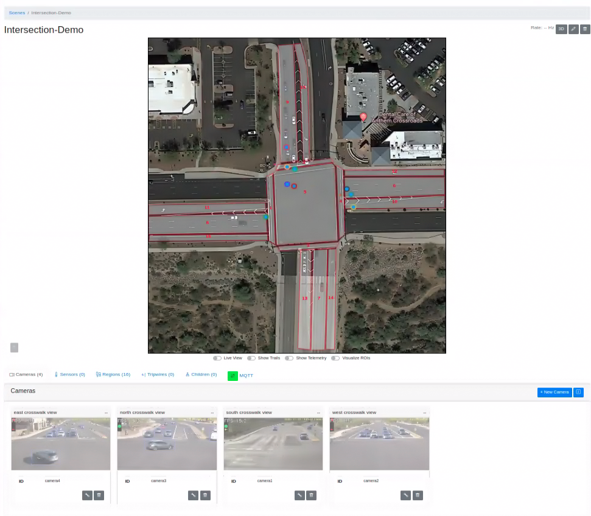
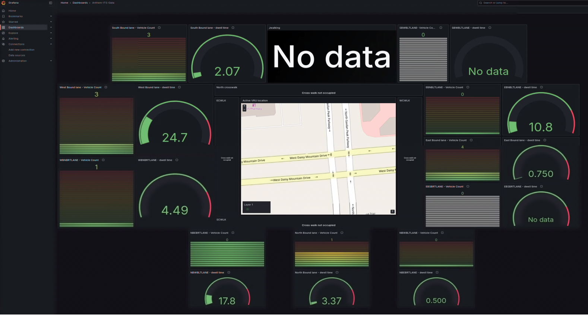

# Get Started

The Smart Corridor Sample Application is a modular sample application designed to help
developers create intelligent intersection monitoring solutions. By leveraging AI and sensor
fusion, this sample application demonstrates how to achieve accurate traffic detection,
congestion management, and real-time alerting.

To get started:

- **Set up the sample application**: use Docker Compose to quickly deploy the application in
  your environment.
- **Run a predefined pipeline**: execute a sample pipeline to see real-time transportation
  monitoring and object detection in action.
- **Access the application's features and user interfaces**: explore the Scenescape
  Web UI, Grafana dashboard, Node-RED interface, and DL Streamer Pipeline Server to monitor,
  analyze and customize workflows.
- **Consider Enabling Security features**: use hardware-based security measures to make your
  application safer.

## Prerequisites

- Verify that your system meets the [minimum requirements](./get-started/system-requirements.md).
- Install Docker: [Installation Guide](https://docs.docker.com/get-docker/).
- Enable running docker without "sudo": [Post Install](https://docs.docker.com/engine/install/linux-postinstall/).
- Install Git: [Installing Git](https://git-scm.com/book/en/v2/Getting-Started-Installing-Git).

## Setup and First Use

**Clone the Suite**:

   Go to the target directory of your choice and clone the suite.
   If you want to clone a specific release branch, replace `main` with the desired tag.
   To learn more on partial cloning, check the [Repository Cloning guide](https://docs.openedgeplatform.intel.com/dev/OEP-articles/contribution-guide.html#repository-cloning-partial-cloning).

   ```bash
   git clone --filter=blob:none --sparse --branch main https://github.com/open-edge-platform/edge-ai-suites.git
   cd edge-ai-suites
   git sparse-checkout set metro-ai-suite
   cd metro-ai-suite/metro-vision-ai-app-recipe/
   ```

## Multi-Machine Deployment (Parent / Child)

The Smart Corridor application supports multi-machine deployments where one **parent** machine
aggregates scene data from one or more **child** machines. Each child runs its own set of
camera pipelines and sends tracking data to the parent's scene controller.

### Deployment Architecture

```
Parent Machine
├── SceneScape Controller (aggregates all scenes)
├── SceneScape Manager (Web UI)
├── DLStreamer (local cameras: camera1–camera4)
├── MQTT Broker (port 1883 TLS, 1882 internal)
└── CA Server (port 8888, serves CA cert to parent)

Child Machine
├── DLStreamer (child cameras: camera401–camera404)
├── MQTT Broker (port 1883 TLS)
└── CA Server (port 8888, serves CA cert to parent)
```

### Important Notes for Multi-Machine Deployments

- **Deploy child nodes first**: The parent's `ca-bundle.sh` fetches CA certificates from
  child nodes via HTTP (port 8888). **Child nodes must be installed and running before the parent node installation.**
- **Network access**: Port 8888 (CA server) and port 1883 (MQTT TLS) must be accessible
  between machines.
- **Scene configuration**: After deployment, add the remote child scene in the SceneScape
  Web UI under the parent scene's settings (using the child's broker IP and port 1883).
- **Time synchronization**: Ensure NTP is synchronized across all machines to avoid a delayed or no tracking behaviour in Smart-Corridor Scene.

> **Note:** For a single-node deployment (no remote child), skip this below section and go
> directly to [Deploy a Parent Node](#deploy-a-parent-node).

### Deploy a Child Node

If there are multiple child nodes to be deployed, then number each node deployment(**REMOTE_CHILD_DEPLOY**) starting from `1` in their respective [.env](../../../.env) file:

1. Clone and enter the directory (same as [Setup and First Use](#setup-and-first-use) above).

2. The Smart-Corridor needs to know which Child node this deployment is. So, configure `REMOTE_CHILD_DEPLOY` as `1` or `2` or `3` in the [.env](../../../.env) file to select a specific child scene data and pipeline configuration:

   ```bash
   REMOTE_CHILD_DEPLOY=1
   ```

   - If `REMOTE_CHILD_DEPLOY=1` is set, the installer picks `smart-corridor-child-1-ri.tar.bz2` and `config_child_1.json`.
   - If `REMOTE_CHILD_DEPLOY=2` is set, the installer picks `smart-corridor-child-2-ri.tar.bz2` and `config_child_2.json`, and so on.

3. Run the install script:

   - Use the installation script to configure the application and download required models:

     ```bash
     ./install.sh smart-corridor
     ```

    > **Note:** For environments requiring a specific host IP address (for example, when deploying across different network interfaces), you can explicitly
    > specify the IP address (Replace `<HOST_IP>` with your target IP address.):
    > `./install.sh smart-corridor <HOST_IP>`

   The installer detects which child node deployment it is and
   automatically:
   - Uses child-specific scene data (`smart-corridor-child-${REMOTE_CHILD_DEPLOY}-ri.tar.bz2`)
   - Uses child-specific pipeline config (`config_child_${REMOTE_CHILD_DEPLOY}.json`)

4. **Start the Application**:
   - Export admin password as environment variable:

     ```bash
     export SUPASS=$(cat ./smart-corridor/src/secrets/supass)
     ```

   - Download container images with Application microservices and run with Docker Compose:

     ```bash
     docker compose up -d
     ```

- Repeat the above steps in [Deploy a Child Node](#deploy-a-child-node) section for all the Child node deployments by incrementing the REMOTE_CHILD_DEPLOY value for every other Child node deployment.

### Deploy a Parent Node

On the parent machine, configure the [.env](../../../.env) file to declare how many remote child nodes exist:

1. Clone and enter the directory (same as [Setup and First Use](#setup-and-first-use) above).

2. Configure the [.env](../../../.env) file with the remote child IPs:

   For Single Node deployment with no child nodes:

   ```bash
   TOTAL_REMOTE_CHILD=0
   ```
   For Multi Node deployment, mention total number of remote child nodes that were deployed and corresponding Host IP addresses:

   ```bash
   TOTAL_REMOTE_CHILD=1
   REMOTE_IP_1=<CHILD_MACHINE_IP>
   ```

   For multiple child nodes:

   ```bash
   TOTAL_REMOTE_CHILD=2
   REMOTE_IP_1=10.223.22.20
   REMOTE_IP_2=10.223.22.30
   ```

3. Run the install script:

   - Use the installation script to configure the application and download required models:

     ```bash
     ./install.sh smart-corridor
     ```

    > **Note:** For environments requiring a specific host IP address (for example, when deploying across different network interfaces), you can explicitly
    > specify the IP address (Replace `<HOST_IP>` with your target IP address.):
    > `./install.sh smart-corridor <HOST_IP>`

   The installer detects a parent node deployment (`TOTAL_REMOTE_CHILD` defined in `.env`) and
   automatically:
   - Uses parent-specific scene data (`smart-corridor-parent-ri.tar.bz2`)
   - Uses parent-specific pipeline config (`config_parent.json`)
   - Runs `ca-bundle.sh` to fetch CA certificates from each remote child and build a
     combined trust bundle for TLS connectivity

4. **Start the Application**:
   - Export admin password as environment variable:

     ```bash
     export SUPASS=$(cat ./smart-corridor/src/secrets/supass)
     ```

   - Download container images with Application microservices and run with Docker Compose:

     ```bash
     docker compose up -d
     ```

   <details>
   <summary>
   Check Status of Microservices
   </summary>

   - The application starts the following microservices.
   - To check if all microservices are in Running state:

     ```bash
     docker ps
     ```

   **Expected Services:**
   - Grafana Dashboard
   - DL Streamer Pipeline Server
   - MQTT Broker
   - Node-RED
   - Scenescape services

   </details>

2. **View the Application Output**:
   - Open a browser and go to `https://localhost/grafana/` to access the Grafana dashboard.
     - Change the localhost to your host IP if you are accessing it remotely.
   - Log in with the following credentials:
     - **Username**: `admin`
     - **Password**: `admin`
   - Check under the Dashboards section for the application-specific preloaded dashboard.
   - **Expected Results**: The dashboard displays real-time video streams with AI overlays
     and detection metrics.

## Access the Application and Components

### Application UI

Open a browser and go to the following endpoints to access the application. Use `<actual_ip>`
instead of `localhost` for external access:

> **Note:**
>
> - All services are accessed through the nginx reverse proxy at `https://localhost` with appropriate paths.
> - For passwords stored in files (e.g., `supass` or `influxdb2-admin-token`), refer to the respective secret files in your deployment under ./src/secrets (Docker) or chart/files/secrets (Helm).
> - Since the application uses HTTPS with self-signed certificates, your browser may display a certificate warning. For the best experience, use **Google Chrome** and accept the certificate.

- **URL**: [https://localhost](https://localhost)
- **Log in with credentials**:
  - **Username**: `admin`
  - **Password**: Stored in `supass`. (Check `./smart-corridor/src/secrets/supass`)

> **Note**:
>
> - After starting the application, wait approximately 1 minute for the MQTT broker to initialize. You can confirm it is ready when green arrows appear for MQTT in the application interface. Since the application uses HTTPS, your browser may display a self-signed certificate warning. For the best experience, use **Google Chrome**.

### Grafana UI

- **URL**: [https://localhost/grafana/](https://localhost/grafana/)
- **Log in with credentials**:
  - **Username**: `admin`
  - **Password**: `admin` (You will be prompted to change it on first login.)

### InfluxDB UI

- **URL**: [http://localhost:8086](http://localhost:8086)
- **Log in with credentials**:
  - **Username**: `<your_influx_username>` (Check `./smart-corridor/src/secrets/influxdb2/influxdb2-admin-username`)
  - **Password**: `<your_influx_password>` (Check `./smart-corridor/src/secrets/influxdb2/influxdb2-admin-password`).

### NodeRED UI

- **URL**: [https://localhost/nodered/](https://localhost/nodered/)

### DL Streamer Pipeline Server

- **REST API**: [https://localhost/api/pipelines/status](https://localhost/api/pipelines/status)
  - **Check Pipeline Status**:

    ```bash
    curl -k https://localhost/api/pipelines/status
    ```

## Verify the Application

- **Fused object tracks**: in Scene Management UI, click on the Intersection-Demo card to
  navigate to the Scene. On the Scene page, you will see fused tracks moving on the map. You
  will also see greyed out frames from each camera. Toggle the "Live View" button to see the
  incoming camera frames. The object detections in the camera feeds will correlate to the
  tracks on the map.

  

- **Grafana Dashboard**: In Grafana UI, observe aggregated analytics of different regions of
  interests in the grafana dashboard. After navigating to Grafana home page, click on
  "Dashboards" and click on item "Anthem-ITS-Data".

  

## **Stop the Application**

- To stop the application microservices, use the following command:

    ```bash
    docker compose down
    ```

## Deploy with Trusted Compute

Intel Trusted Compute runs workloads inside a hardware-isolated virtual machine, providing an additional layer of security for sensitive AI workloads.

> **Note:** GPU acceleration is currently not supported when deploying with Trusted Compute.

### 1. Install Trusted Compute

Follow the [Trusted Compute baremetal installation guide](https://github.com/open-edge-platform/trusted-compute/blob/main/docs/trusted_compute_baremetal.md) to install Trusted Compute runtime version 1.5.0 on your host system. Complete the following sections:

- Prerequisites
- Download the Trusted Compute Package
- Docker Option

> **Note:** Trusted Compute version 1.5.0 is required for this deployment.

> **Note:** Trusted Compute 1.5.0 is not compatible with Docker version 29.5 or later. Docker version 29.4.x is required (tested with 29.4.3).

### 2. Deploy the Smart Corridor Sample Application with Trusted Compute

**Configure Network Settings**

By default, Trusted Compute uses the subnet `172.20.0.0/16` for isolated container networking. If this subnet conflicts with your existing networks, you can customize it before deployment.

Requirements:

- Subnet format must be exactly `172.X.0.0/16` where `X` is between 18–31 (RFC 1918 private IP range)
- The subnet must not conflict with existing Docker networks on your system
- DNS relay service will be automatically configured at `172.X.0.200`

Example:

```bash
# Optional: Customize the subnet if needed (default is 172.20.0.0/16)
export TC_SUBNET=172.25.0.0/16  # DNS relay will be at 172.25.0.200
```

**Deploy with Trusted Compute**

```bash
export ENABLE_TC=true
./install.sh smart-corridor
```

The DL Streamer Pipeline Server containers will run inside hardware-isolated TC VMs, protecting inference workloads and video data from untrusted co-tenants on the same host.

**Start the Application**

```bash
docker compose up -d
```

Once the application is running, follow the [Access the Application and Components](#access-the-application-and-components) section to access the UI and services.

**Stop the Application**

```bash
docker compose down
```

To uninstall Trusted Compute from the host, refer to the [Trusted Compute documentation](https://github.com/open-edge-platform/trusted-compute/blob/main/docs/trusted_compute_baremetal.md).

## Other Deployment Options

Choose one of the following methods to deploy the Smart Corridor Sample Application:

- **[Deploy Using Helm](./get-started/deploy-with-helm.md)**: Use Helm to deploy the
  application to a Kubernetes cluster for scalable and production-ready deployments.

## Security Enablement

With AI systems handling sensitive city data and making autonomous decisions, robust security
is essential. Intel platforms provide built-in security features to protect data, infrastructure,
and AI processing. See the [Security Enablement Guide](https://docs.openedgeplatform.intel.com/dev/OEP-articles/application-security.html)
that uses the example of Smart Corridor to show how to secure Open Edge Platform
applications.

## Learn More

- [Security Enablement Guide](https://docs.openedgeplatform.intel.com/dev/OEP-articles/application-security.html)
- [Troubleshooting](./troubleshooting.md): Find detailed steps to resolve common issues during deployments.
- [DL Streamer Pipeline Server](https://docs.openedgeplatform.intel.com/dev/edge-ai-libraries/dlstreamer-pipeline-server/index.html): Intel microservice based on Python for video ingestion and deep learning inferencing functions.
- [Scenescape](https://docs.openedgeplatform.intel.com/dev/scenescape/index.html): Intel Scene-based AI software framework.

<!--hide_directive
:::{toctree}
:hidden:

get-started/system-requirements.md
get-started/deploy-with-helm.md

:::
hide_directive-->
