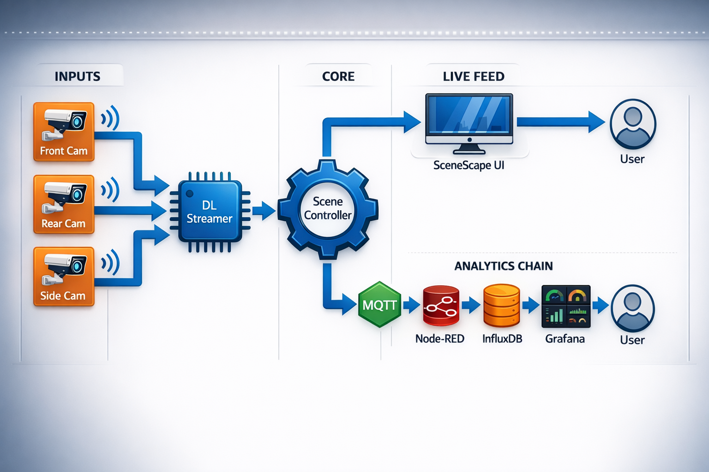

# How It Works

This section provides a high-level view of how the application integrates with a typical system architecture.

## Diagram Description

- **Inputs**:

  Video recordings are used to simulate a live feed from cameras deployed at a toll.
  The application can be configured to work with live cameras.

  - **Video Files** - Tolling cameras that capture videos simultaneously from front,
    rear and side profiles.
  - **Scene Database** - Pre-configured intersection scene with satellite view of
    tolling area, calibrated cameras and regions of interest.

- **Processing**:

  - **Video Analytics** - Deep Learning Streamer Pipeline Server
    (DL Streamer Pipeline Server) utilizes a pre-trained object detection model
    to generate object detection metadata and and a local NTP server for
    synchronized timestamps. This metadata is published to the MQTT broker.
  - **Sensor Fusion** - Scene Controller Microservice fuses the metadata from
    video analytics utilizing scene data obtained through the Scene Management API.
    It uses the fused tracks and the configured analytics (regions of interest)
    to generate events that are published to the MQTT broker.
  - **Aggregate Scene Analytics** - Region of interests analytics are read from
    the MQTT broker and stored in an InfluxDB bucket that enables time series analysis through Flux queries.
- **Outputs**:
  - Fused object tracks are available on the MQTT broker and visualized through the Scene Management UI.
  - Aggregated toll analytics are visualized through a Grafana dashboard.

## Key Features

- **Feature 1**: Architecture based on modular microservices enables composability and reconfiguration.
- **Feature 2**: Optimized video pipelines for Intel edge devices.
- **Feature 3**: Scene-based analytics allow insights beyond single sensor views.

## Learn More

- [System Requirements](./get-started/system-requirements.md):
  Check the hardware and software requirements for deploying the application.
- [Get Started](./get-started.md):
  Follow step-by-step instructions to set up the application.
- [Technical Reference](./how-it-works/technical-reference.md): Learn more about engineering specification and
  how to use Zero-Copy Pipeline and API.
- [Support and Troubleshooting](./troubleshooting.md):
  Find solutions to common issues and troubleshooting steps.

<!--hide_directive
:::{toctree}
:hidden:

./how-it-works/technical-reference

:::
hide_directive-->
