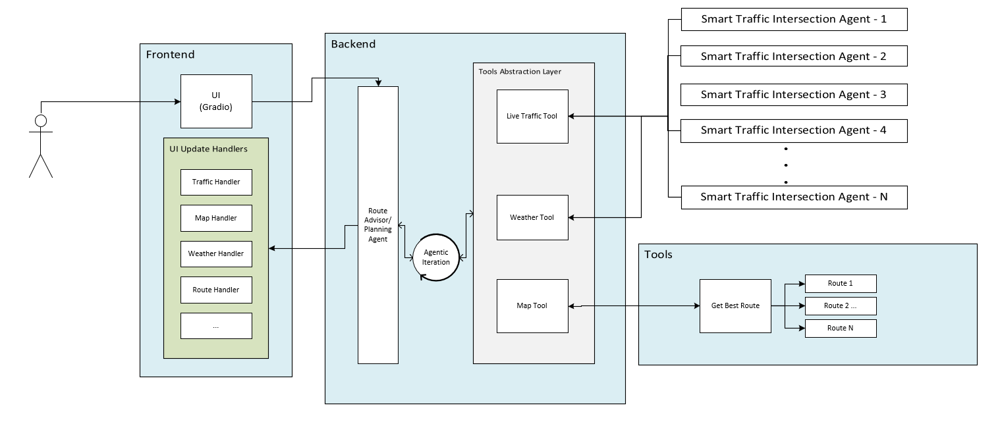

# Smart Route Planning Agent

The Smart Route Planning Agent is an AI-powered route optimization agent that uses multi-agent communication to analyze traffic intersections and find incident-free paths between source and destination in real-time.

1. [Use Cases and Features](#use-cases-and-key-features)
2. [How the Application Works](#how-the-application-works)
3. [Learn More](#learn-more)

## Use Cases and Key Features

**Real-time Route Optimization**: Analyze multiple routes between source and destination to find the optimal path based on live traffic conditions.

**Incident Avoidance**: Identify and avoid routes affected by congestion, weather, roadblocks, or accidents.

**Multi-Agent Traffic Analysis**: Communicates with [Smart Traffic Intersection Agent](../../../../smart-traffic-intersection-agent/README.md) to gather live analysis reports for informed routing decisions.

### Key Features

**AI Agent Architecture**: Intelligent agent that coordinates with other agents to fetch and analyze traffic data.

**Real-time Analysis**: Live traffic intersection analysis for dynamic route recommendations.

**Incident Detection**: Identifies potential issues like congestion, weather conditions, roadblocks, and accidents along routes.

## How the Application Works

The agent receives source and destination inputs, finds the shortest route from available routes, queries traffic intersection agents for live reports, and determines the optimal route.



### Data Flow

```
User Input (Source/Destination) → Route Planning Agent
                                  ├─→ Find Shortest Route (from GPX files)
                                  ├─→ Query Traffic Intersection Agents
                                  ├─→ Analyze Route Conditions
                                  └─→ Return Optimal Route
```

## Learn More

- [System Requirements](./system-requirements.md)
- [Get Started](./get-started.md)
- [Release Notes](./release-notes.md)

<!--hide_directive
:::{toctree}
:hidden:

get-started
system-requirements
environment-variables
build-from-source
release-notes

:::
hide_directive-->
