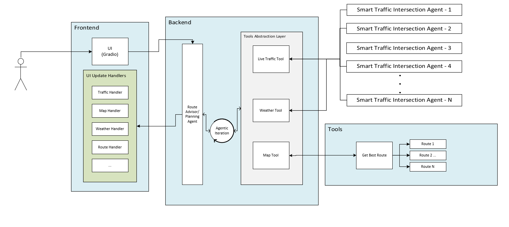

# Smart Route Planning Agent

| **STATUS** |  Work in Progress |
|------------| ------------------|

The Smart Route Planning Agent analyzes the route between the given source and destination, and communicates with other agents to fetch live analysis reports for traffic intersections found along feasible routes between the source and destination. Subsequently, the agent finds an optimum route in real-time, which is likely free from any possible incidents such as congestion, weather, roadblocks, and accidents.

    

## Learn More

- [Get Started Guide](get-started.md)
- [API Reference](api-reference.md)
- [System Requirements](system-requirements.md)

<!--hide_directive
:::{toctree}
:hidden:

get-started
system-requirements
environment-variables
traffic-data-analysis-workflow
how-it-works
release-notes

:::
hide_directive-->