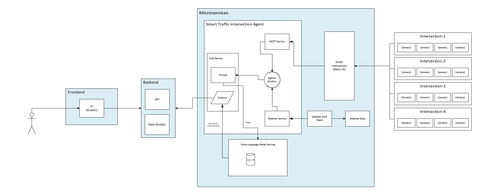

# Scene Intelligence microservice

The Scene Intelligence microservice is a comprehensive traffic analysis service that provides real-time intersection monitoring, directional traffic density analysis, and Vision Language Model (VLM) powered traffic insights. It processes MQTT traffic data, manages camera images, and delivers intelligent traffic analysis through RESTful APIs.

## Overview

The microservice processes real-time traffic data from MQTT streams and provides advanced analytics including directional traffic density monitoring, VLM-powered traffic scene analysis, and comprehensive traffic summaries. It supports sliding window analysis, sustained traffic detection, and intelligent camera image management for enhanced traffic insights.

    

## Supporting Resources

- [Get Started Guide](get-started.md)
- [API Reference](api-reference.md)
- [System Requirements](system-requirements.md)
