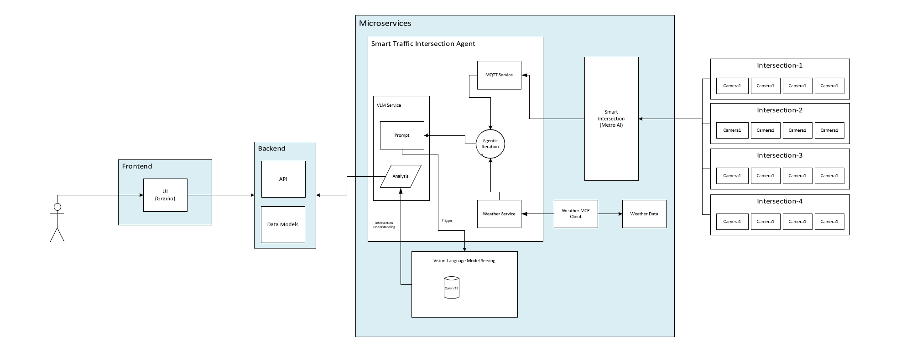

# How It Works

## Scene Intelligence Microservice

The Smart Traffic Intersection agent uses the Scene Intelligence microservice that monitors traffic intersection at real time. The Scene Intelligence microservice processes real-time traffic data from Message Queuing Telemetry Transport (MQTT) streams and provides advanced analytics on, but not limited to, directional traffic density, Vision Language Model (VLM)-powered traffic scene, and traffic.

The microservice supports sliding-window analysis, sustained traffic detection, and intelligent management of camera images to enhance traffic insights.

    

## Supporting Resources

- [Get Started Guide](get-started.md)
- [API Reference](api-reference.md)
- [System Requirements](system-requirements.md)
