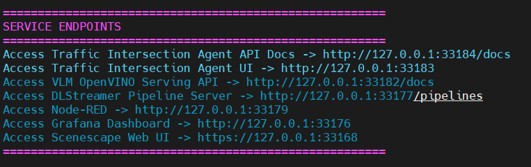

# Get Started

The **Smart Traffic Intersection Agent (STIA)** provides analytics that include real-time
intersection, directional traffic density, and VLM-powered traffic, among others. This section
shows you how to:

- Set up the agent using the automated setup script for quick deployment.
- Run predefined tasks to explore the agent's functionality.
- Edit configurations to suit specific requirements.

## Prerequisites

Before you begin, ensure the following:

- **System requirements**: Verify that your system meets the [minimum requirements](./get-started/system-requirements.md).
- **Docker platform**: Install Docker platform. For installation instructions, see [Get Docker](https://docs.docker.com/get-docker/).
- **Message Queuing Telemetry Transport (MQTT) Broker**: Ensure access to an MQTT broker for
traffic data streaming, or use the included broker.
- **Docker commands and terminal usage**: You are familiar with Docker commands and using the
terminal. If you are new to Docker, see [Docker Documentation](https://docs.docker.com/) for
an introduction.

## Quick Start with Setup Script

Intel recommends using the automated setup script that handles environment configuration,
submodule and dependencies setup, secrets generation, building, and deployment of the Smart
Traffic Intersection Agent.

### 1. Clone the Repository

```bash
git clone https://github.com/open-edge-platform/edge-ai-suites.git
cd metro-ai-suite/smart-traffic-intersection-agent/
```

### 2. Run the Complete Setup

The easiest way to set up the service is to use default configurations without making any
changes. Run the setup script with the `--setup` option to set up the agent quickly with
the default configurations:

```bash
source setup.sh --setup
```

This single command will:

- Set required environment variables with default values
- Set up dependencies and submodules required for Smart Traffic Intersection Agent
- Generate the required TLS certificates and authentication files
- Download demo video files for testing
- Build Docker images
- Start services in the Smart Traffic Intersection Agent's application stack

### 3. Access Services

When the script completes, it will show the URLs to access the services. Go to these URLs so
that the respective services can access them in a web browser.

## Running Multiple Instances (Test or Development Only)

For testing or development purposes, you can run multiple instances of the Smart Traffic
Intersection Agent to simulate multiple intersections on the same development machine or node.
The easiest way to do this is to clone and set up the application `n times` in n different
locations on the same machine for `n` required instances.

> **Note:** In production environments, only a single Traffic Intersection Agent instance is
> deployed on a given node.

> **Intel's recommendation:** The number of instances you can run on a single machine depends
> on available resources. Systems with higher resources can support more instances.

### Set up Instance #1

1. Clone the repository into a new directory:

```bash
# First instance
git clone --depth 1 https://github.com/open-edge-platform/edge-ai-suites.git edge-ai-suites-instance1
cd edge-ai-suites-instance1/metro-ai-suite/smart-traffic-intersection-agent/
```

2. Edit the deployment configuration file for instance #1:

```bash
nano src/config/deployment_instance.json
```

Update the `latitude` and `longitude` values as required. If not required, use the default
values without updating this config file. Following is a sample value for the Instance #1
deployment config:

```json
{
    "name": "intersection_1",
    "latitude": 37.7049108,
    "longitude": -121.9096158,
    "agent_backend_port": "8081",
    "agent_ui_port": "7860"
}
```

3. Run the setup for instance #1:

```bash
source setup.sh --setup
```

### Set up Instance #2

1. Clone the repository into a new directory:

Open a new terminal window and move to different directory and run the following.

```bash
git clone --depth 1 https://github.com/open-edge-platform/edge-ai-suites.git edge-ai-suites-instance2
cd edge-ai-suites-instance2/metro-ai-suite/smart-traffic-intersection-agent/
```

2. Edit the deployment configuration for instance #2:

```bash
nano src/config/deployment_instance.json
```

The following is a sample value for instance #2 deployment configuration:

```json
{
    "name": "intersection_2",
    "latitude": 37.33874,
    "longitude": -121.8852525,
    "agent_backend_port": "8082",
    "agent_ui_port": "7861"
}
```
3. Run Setup for Instance #2

```bash
source setup.sh --setup
```

> **Note:** Keep the `agent_backend_port` and `agent_ui_port` values empty to use random
> ephemeral ports and avoid port conflicts.

Ensure each instance has their `deployment_instance.json` updated with:

- A unique value for `name` field
- Unique latitude and longitude co-ordinates
- Different `agent_backend_port` and `agent_ui_port` values to avoid port conflicts. This is
optional. If not specified, an ephemeral port is picked automatically.

### Deploying More Instances

There are functionally no limits on the number of instances that you can spin up to simulate
a multi-node setup using the provided script. However, the machine on which the multiple
deployments are deployed to, will likely start throttling these instances if resource limits
are reached. Hence, deploy new instances only if you have the required resource bandwidth.

To spin-up more instances - say `n number of new instances`, repeat the steps mentioned in
[Set up Instance #2](#set-up-instance-2), by changing to a new directory `n` times.

## Advanced Environment Configuration

For advanced users who need more control over the configuration, you can configure the
following environment variables before running the setup script to override the default
behaviour:

```bash
# Set log level to debug to help in debugging issues, default value is info
export LOG_LEVEL=DEBUG

# Change the VLM Model name. Default value set in script.sh is microsoft/Phi-3.5-vision-instruct.
export VLM_MODEL_NAME=Qwen/Qwen2.5-VL-3B-Instruct

# Other VLM related config, sample values
export VLM_TIMEOUT_SECONDS=600          # Default 300
export VLM_MAX_COMPLETION_TOKENS=1000   # Default 1500
export VLM_TEMPERATURE=0.4              # Default 0.1, range 0-1; controls randomness of response
export VLM_TOP_P=0.3                    # Default 0.1, range 0-1; another parameter to control randomness and diversity of response

# Some sample values for Traffic Intersection configuration
export HIGH_DENSITY_THRESHOLD=5        # Default value 10
export MODERATE_DENSITY_THRESHOLD=3    # Default value 5; Make sure this is less than HIGH_DENSITY_THRESHOLD
export TRAFFIC_BUFFER_DURATION=20      # Default value 30; Analysis window of traffic feeds in seconds
```

## Accessing the Services

After the setup process completes, the URLs for all services are displayed on the terminal.
You can get the URL for **Traffic Intersection Agent UI** and **Traffic Intersection Agent API Docs**
from the response, and access it in a web browser.

The following is a sample response that you might get at script completion, which displays the
URLs for accessing the relevant services:



## Troubleshooting

### Port Conflicts for Traffic Intersection Agent Backend or UI

Ensure that the config file at `src/config/deployment_instance.json` for all instances
(deployed from different directories, in case of multiple deployment on same machine) has
empty values for the `agent_backend_port` and `agent_ui_port` fields:

```bash
    ...
    "agent_backend_port": "",
    "agent_ui_port": ""
    ...
```

Intel recommends to keep these values empty and let the Docker engine use ephemeral ports.
However, if you need to provide an explicit port, ensure port values for all instances are
unique. Additionally, ensure no other external services are running on these ports.

<!--hide_directive
:::{toctree}
:hidden:

./get-started/system-requirements
./get-started/build-from-source

:::
hide_directive-->
