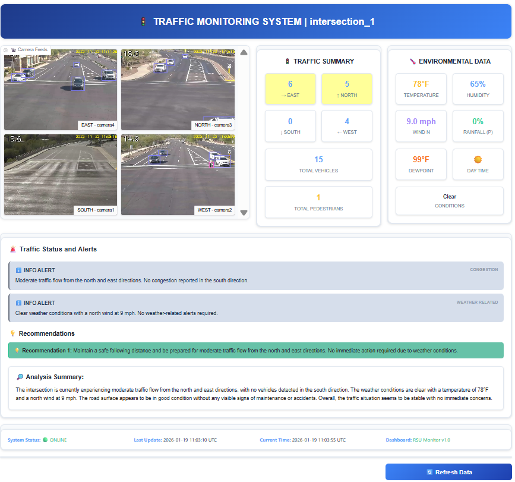

# Smart Traffic Intersection Agent

The Smart Traffic Intersection Agent is a comprehensive traffic analysis service that provides
real-time intersection monitoring, directional traffic density analysis, and Vision Language
Model (VLM) powered traffic insights.
It processes MQTT traffic data, manages camera images, and delivers intelligent traffic
analysis through RESTful APIs.

The agent supports sliding-window analysis, sustained traffic detection, and intelligent
management of camera images to enhance traffic insights.

The following figure shows the high-level architecture of the Smart Traffic Intersection Agent,
showcasing its core components and their interactions with external systems.

The Smart Traffic UI below shows how traffic and weather data is analyzed, and how summary
and alerts are shown to the user.

## Components

The Smart Traffic Intersection stack includes the following containerized services:

- **MQTT Broker** (Eclipse Mosquitto message broker) - Message broker for traffic data
- **DL Streamer Pipeline Server** - Video analytics and AI inference
- **SceneScape Database** - Configuration and metadata storage
- **SceneScape Web Server** - Management interface
- **SceneScape Controller** - Orchestration service
- **VLM OpenVINO Serving** - Vision Language Model inference
- **Traffic Intelligence** - Real-time traffic analysis with dual interface (API and UI)

### Key Integration Points

- **MQTT Communication**: All services communicate via the shared MQTT broker
- **Docker Network**: Services discover each other via Docker service names
- **Shared Secrets**: TLS certificates and auth files mounted from `src/secrets/`
- **Persistent Storage**: Traffic data stored in Docker volume `traffic-intelligence-data`
- **Health Monitoring**: All services include health check endpoints

## Learn More

- [Get Started Guide](./get-started.md)
- [API Reference](./api-reference.md)
- [System Requirements](./get-started/system-requirements.md)

<!--hide_directive
:::{toctree}
:hidden:

get-started
api-reference
release-notes

:::
hide_directive-->
