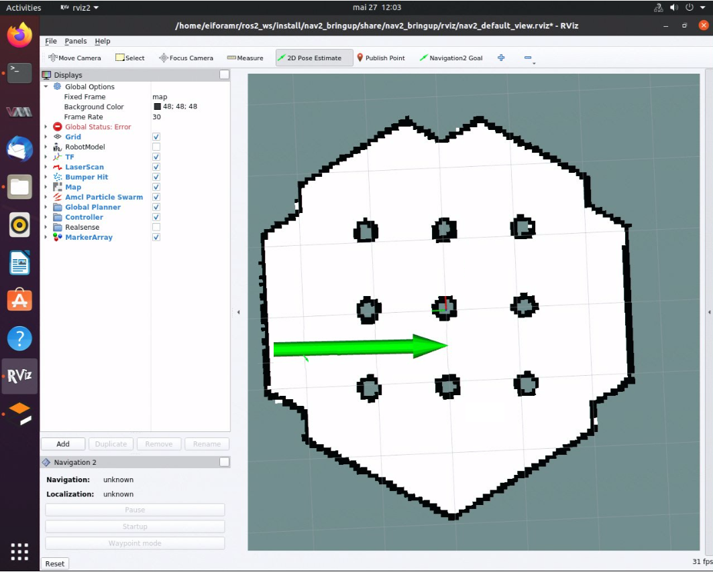

# ITS Path Planner ROS 2 Navigation Plugin

Intelligent Sampling and Two-Way Search (ITS) global path planner is an Intel®
patented algorithm.

The ITS Plugin for the ROS 2 Navigation 2 application plugin is a global path
planner module that is based on Intelligent sampling and Two-way Search (ITS).

ITS is a new search approach based on two-way path planning and intelligent
sampling, which reduces the compute time by about 20x-30x on a 1000 nodes map
comparing with the A\* search algorithm. The inputs are the 2D occupancy grid
map, the robot position, and the goal position.

It does not support continuous replanning.

Prerequisites: Use a simple behavior tree with a compute path to pose and a
follow path.

ITS planner inputs:

- global 2D costmap (`nav2_costmap_2d::Costmap2D`)
- start and goal pose (`geometry_msgs::msg::PoseStamped`)

ITS planner outputs: 2D waypoints of the path

Path planning steps summary:

1. The ITS planner converts the 2D costmap to either a Probabilistic Road Map
   (PRM) or a Deterministic Road Map (DRM).
2. The generated roadmap is saved as a txt file which can be reused for multiple
   inquiries.
3. The ITS planner conducts a two-way search to find a path from the source to
   the destination. Either the smoothing filter or a catmull spline
   interpolation can be used to create a smooth and continuous path. The
   generated smooth path is in the form of a ROS 2 navigation message type
   (`nav_msgs::msg`).

For customization options, see
[ITS Path Planner Plugin Customization](#ITS-Path-Planner-Plugin-Customization).

## Source Code

The source code of this component can be found here:
[ITS-Planner](https://github.com/open-edge-platform/edge-ai-suites/tree/main/robotics-ai-suite/components/its-planner)

## Getting Started

Autonomous Mobile Robot provides a ROS 2 Deb package for the application,
supported by the following platform:

- ROS version: Jazzy, Humble

### Prerequisites

Complete the [get started guide](../../../gsg_robot/index.md) before continuing.

### Install Deb package

Install dependencies required to run simulations:

<!--hide_directive::::{tab-set}
:::{tab-item}hide_directive--> **Jazzy**
<!--hide_directive:sync: jazzyhide_directive-->

```bash
sudo apt install ros-jazzy-turtlebot3-gazebo
```

<!--hide_directive:::
:::{tab-item}hide_directive-->  **Humble**
<!--hide_directive:sync: humblehide_directive-->

```bash
sudo apt install ros-humble-turtlebot3-gazebo
```

<!--hide_directive:::
::::hide_directive-->

Install the ITS Path Planner Deb package from the
Intel® Autonomous Mobile Robot APT repository

<!--hide_directive::::{tab-set}
:::{tab-item}hide_directive--> **Jazzy**
<!--hide_directive:sync: jazzyhide_directive-->

```bash
sudo apt install ros-jazzy-its-planner
```

<!--hide_directive:::
:::{tab-item}hide_directive-->  **Humble**
<!--hide_directive:sync: humblehide_directive-->

```bash
sudo apt install ros-humble-its-planner
```

<!--hide_directive:::
::::hide_directive-->

Run the following script to set environment variables:

<!--hide_directive::::{tab-set}
:::{tab-item}hide_directive--> **Jazzy**
<!--hide_directive:sync: jazzyhide_directive-->

```bash
source /opt/ros/jazzy/setup.bash
export TURTLEBOT3_MODEL=waffle
export GAZEBO_MODEL_PATH=$GAZEBO_MODEL_PATH:/opt/ros/jazzy/share/turtlebot3_gazebo/models
```

<!--hide_directive:::
:::{tab-item}hide_directive-->  **Humble**
<!--hide_directive:sync: humblehide_directive-->

```bash
source /opt/ros/humble/setup.bash
export TURTLEBOT3_MODEL=waffle
export GAZEBO_MODEL_PATH=$GAZEBO_MODEL_PATH:/opt/ros/humble/share/turtlebot3_gazebo/models
```

<!--hide_directive:::
::::hide_directive-->

To launch the default ITS planner which is based on differential drive robot, run:

<!--hide_directive::::{tab-set}
:::{tab-item}hide_directive--> **Jazzy**
<!--hide_directive:sync: jazzyhide_directive-->

```bash
ros2 launch its_planner its_differential_launch.py use_sim_time:=true
```

<!--hide_directive:::
:::{tab-item}hide_directive-->  **Humble**
<!--hide_directive:sync: humblehide_directive-->

```bash
ros2 launch its_planner its_differential_launch.py use_sim_time:=true
```

<!--hide_directive:::
::::hide_directive-->

ITS Planner also supports Ackermann steering; to launch the Ackermann
ITS planner run:

<!--hide_directive::::{tab-set}
:::{tab-item}hide_directive--> **Jazzy**
<!--hide_directive:sync: jazzyhide_directive-->

```bash
ros2 launch its_planner its_ackermann_launch.py use_sim_time:=true
```

<!--hide_directive:::
:::{tab-item}hide_directive-->  **Humble**
<!--hide_directive:sync: humblehide_directive-->

```bash
ros2 launch its_planner its_ackermann_launch.py use_sim_time:=true
```

<!--hide_directive:::
::::hide_directive-->

> **Note**:
>
> The above command opens Gazebo\* and rviz2 applications. Gazebo\* takes a
> longer time to open (up to a minute) depending on the host's capabilities.
> Both applications contain the simulated waffle map, and a simulated robot.
> Initially, the applications are opened in the background, but you can
> bring them into the foreground, side-by-side, for a better visual.

1. Set the robot **2D Pose Estimate** in rviz2:

   1. Set the initial robot pose by pressing **2D Pose Estimate** in rviz2.
   2. At the robot estimated location, down-click inside the 2D map. For
      reference, use the robot pose as it appears in Gazebo\*.
   3. Set the orientation by dragging forward from the down-click. This also
      enables ROS 2 navigation.

   

2. In rviz2, press **Navigation2 Goal**, and choose a destination for the
   robot. This calls the behavioral tree navigator to go to that goal through
   an action server.

   

   

   Expected result: The robot moves along the path generated to its new
   destination.

3. Set new destinations for the robot, one at a time.

   

4. To close this, do the following:

   - Type `Ctrl-c` in the terminal where you did the up command.

## ITS Path Planner Plugin Customization

<!--hide_directive::::{tab-set}
:::{tab-item}hide_directive--> **Jazzy**
<!--hide_directive:sync: jazzyhide_directive-->

The ROS 2 navigation bring-up application is started using
the TurtleBot 3 Gazebo simulation
and it receives as input parameter `nav2_params_jazzy.yaml`.

To use the ITS path planner plugin, the following parameters are added in
`nav2_params_jazzy.yaml`:

> ```yaml
> planner_server:
>   ros__parameters:
>     expected_planner_frequency: 20.0
>     use_sim_time: True
>     planner_plugins: ["GridBased"]
>     costmap_update_timeout: 1.0
>     GridBased:
>       plugin: "its_planner/ITSPlanner"
>       interpolation_resolution: 0.05
>       catmull_spline: False
>       smoothing_window: 15
>       buffer_size: 10
>       build_road_map_once: True
>       enable_k: False
>       min_samples: 250
>       roadmap: "PROBABLISTIC"
>       w: 32
>       h: 32
>       n: 2
> ```


<!--hide_directive:::
:::{tab-item}hide_directive--> **Humble**
<!--hide_directive:sync: humblehide_directive-->

The ROS 2 navigation bring-up application is started using
the TurtleBot 3 Gazebo simulation
and it receives as input parameter `nav2_params_humble.yaml`.

To use the ITS path planner plugin, the following parameters are added in
`nav2_params_humble.yaml`:

> ```yaml
> planner_server:
>   ros__parameters:
>     expected_planner_frequency: 0.01
>     use_sim_time: True
>     planner_plugins: ["GridBased"]
>     GridBased:
>       plugin: "its_planner/ITSPlanner"
>       interpolation_resolution: 0.05
>       catmull_spline: False
>       smoothing_window: 15
>       buffer_size: 10
>       build_road_map_once: True
>       enable_k: False
>       min_samples: 250
>       roadmap: "PROBABLISTIC"
>       w: 32
>       h: 32
>       n: 2
> ```

<!--hide_directive:::
::::hide_directive-->

## ITS Path Planner Plugin Parameters

```bash
catmull_spline:
```

If true, the generated path from the ITS is interpolated with the catmull
spline method; otherwise, a smoothing filter is used to smooth the path.

```bash
smoothing_window:
```

The window size for the smoothing filter (The unit is the grid size.)

```bash
buffer_size:
```

During roadmap generation, the samples are generated away from obstacles. The
buffer size dictates how far away from obstacles the roadmap samples should be.

```bash
build_road_map_once:
```

If true, the roadmap is loaded from the saved file; otherwise, a new roadmap
is generated.

```bash
min_samples:
```

The minimum number of samples required to generate the roadmap

```bash
roadmap:
```

Either PROBABILISTIC or DETERMINISTIC

```bash
w:
```

The width of the window for intelligent sampling

```bash
h:
```

The height of the window for intelligent sampling

```bash
n:
```

The minimum number of samples that is required in an area defined by `w` and `h`.

## ITS Path Planner Plugin Parameters modification

### Default ITS Planner

You can modify plugin parameters by editing the `planner_server` section
in the configuration file below for the `default ITS planner`:


<!--hide_directive::::{tab-set}
:::{tab-item}hide_directive--> **Jazzy**
<!--hide_directive:sync: jazzyhide_directive-->

```bash
/opt/ros/jazzy/share/its_planner/nav2_params_jazzy.yaml
```

<!--hide_directive:::
:::{tab-item}hide_directive-->  **Humble**
<!--hide_directive:sync: humblehide_directive-->

```bash
/opt/ros/humble/share/its_planner/nav2_params_humble.yaml
```

<!--hide_directive:::
::::hide_directive-->

### Ackermann ITS Planner

You can modify plugin parameters by editing the `planner_server` section
in the configuration file below for the `Ackermann ITS planner`:

<!--hide_directive::::{tab-set}
:::{tab-item}hide_directive--> **Jazzy**
<!--hide_directive:sync: jazzyhide_directive-->

```bash
/opt/ros/jazzy/share/its_planner/nav2_params_dubins_jazzy.yaml
```

<!--hide_directive:::
:::{tab-item}hide_directive-->  **Humble**
<!--hide_directive:sync: humblehide_directive-->

```bash
/opt/ros/humble/share/its_planner/nav2_params_dubins_humble.yaml
```

## Troubleshooting

For general robot issues, refer to
[Troubleshooting](../robot-tutorials-troubleshooting.md).
