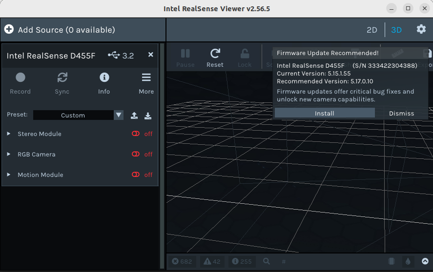
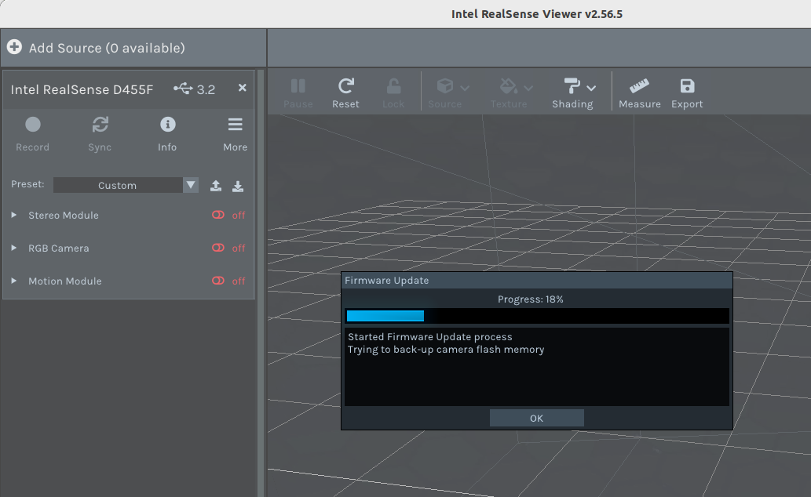
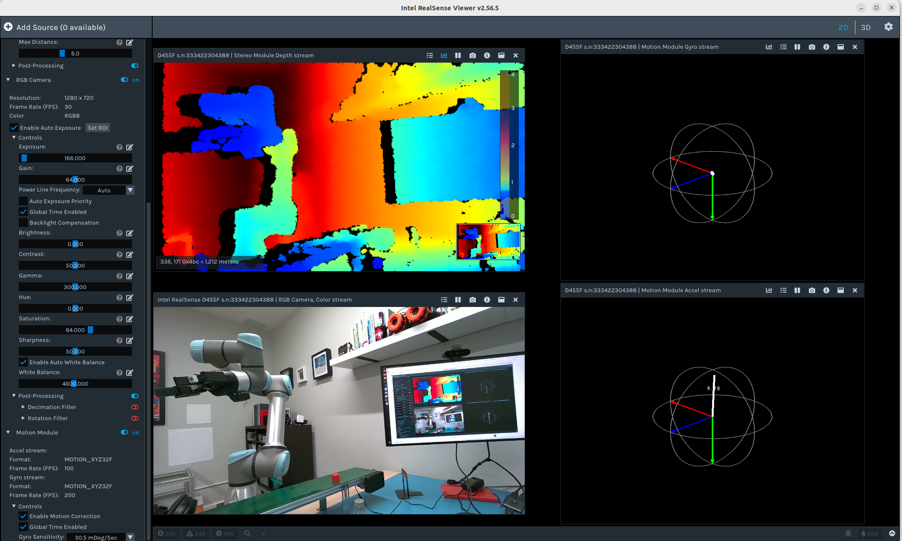

Camera Setup
====================

RVC supports |Realsense| |D4xx| cameras, with many `Exemplary Use Cases <../use_cases.html>`_ utilizing
the `D415 <https://realsenseai.com/stereo-depth-cameras/stereo-depth-camera-d415/>`_. Therefore, choosing the
D415 for your project ensures most example use cases will run with minimal configuration.

Initial Setup
~~~~~~~~~~~~~
Out of the box the |Realsense| cameras need to be updated to the latest firmware version. The most straight forward way to
accomplish this is by using the RealSense Viewer. This software, part of the `Intel® RealSense™ SDK 2.0 <https://github.com/IntelRealSense/librealsense>`_,
is a graphical user interface allowing one to view camera streams, edit configuration files, update firmware, and much more.

If you are running the exemplary use cases their docker containers have the **realsense-viewer** application installed, along with the entire **librealsense2-util** library. This
is great for testing your camera from within the container but firmware updates are not supported in this manner. Therefore this action must be completed on your host machine, let's start by
checking if the tool is installed in your environment.

.. code-block:: bash

    # try to open the viewer
    realsense-viewer

Did the software launch? If yes, containue to the :ref:`firmware-update` section. Otherwise, continue to :ref:`realsense-installation`.

.. _realsense-installation:

RealSense Installation
^^^^^^^^^^^^^^^^^^^^^^

On Ubuntu 22.04, one can build the **librealsense2-utils** and assoictaed libraries from source or install each via the Advanced Package Tool (apt). APT
is fairly straighforward and the recommended approach. if you require more fine-grained control, please review the documentation foumd on the library's
`GitHub page <https://github.com/IntelRealSense/librealsense>`_.

.. code-block:: bash

   # Ensure apt-transport-https is installed to allow apt to handle HTTPS repositories.
   sudo apt-get install apt-transport-https

   # Next, add the Intel RealSense GPG key and repository to your system.
   sudo apt-key adv --keyserver keyserver.ubuntu.com --recv-key F6E65AC044F831AC80A06380C8B3A55A6F3EFCDE
   sudo add-apt-repository "deb https://librealsense.intel.com/Debian/apt-repo $(lsb_release -cs) main"

   # After adding the repository, update your package lists to include the new sources
   sudo apt update

   # Finally, install librealsense2-utils and other required packages.
   sudo apt-get install librealsense2-dkms librealsense2-utils librealsense2-dev

If your selected camera is not plugged-in, do so now. Then run the realsense-viewer:

.. code-block:: bash

   realsense-viewer

.. _firmware-update:

Firmware Update
^^^^^^^^^^^^^^^

With the RealSense Viewer now launched, your attached camera configuration is displayed in the left menu, along with its avilable streams. Pay close
attention to the camera title, it is imperative that you are using a cable which supports USB 3.2. This can be verified by ensuring "3.2" appears after
your camera name (e.g. D415 USB 3.2) as is seen in the below image.

   RealSense Viewer launched

Notice in the above image there is also a firmware notification informing the user the camera needs an update. Click **install** and expand the update window
to reveal the progress. You will be greeted with a pop-up window scrolling detailed information regarding the installation as seen below.

   Firmware update progress display

Once the process has completed, select **2D** from the navigation bar in the upper right, then turn on each stream (e.g. stereo, RGB, motion) to reveal
the outoput tiled within the window. See example output from updating a D455f below:

   Stereo, RGB, and Motion sensors functioning as designed
